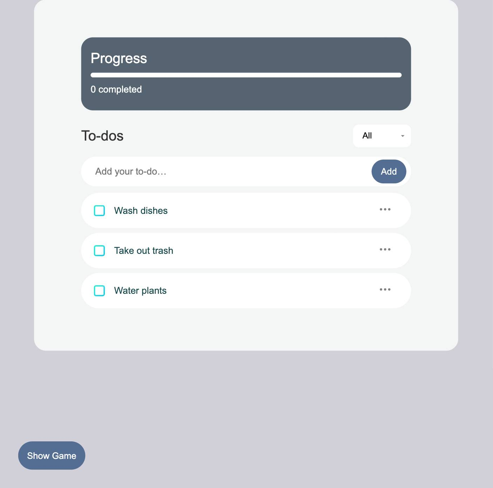
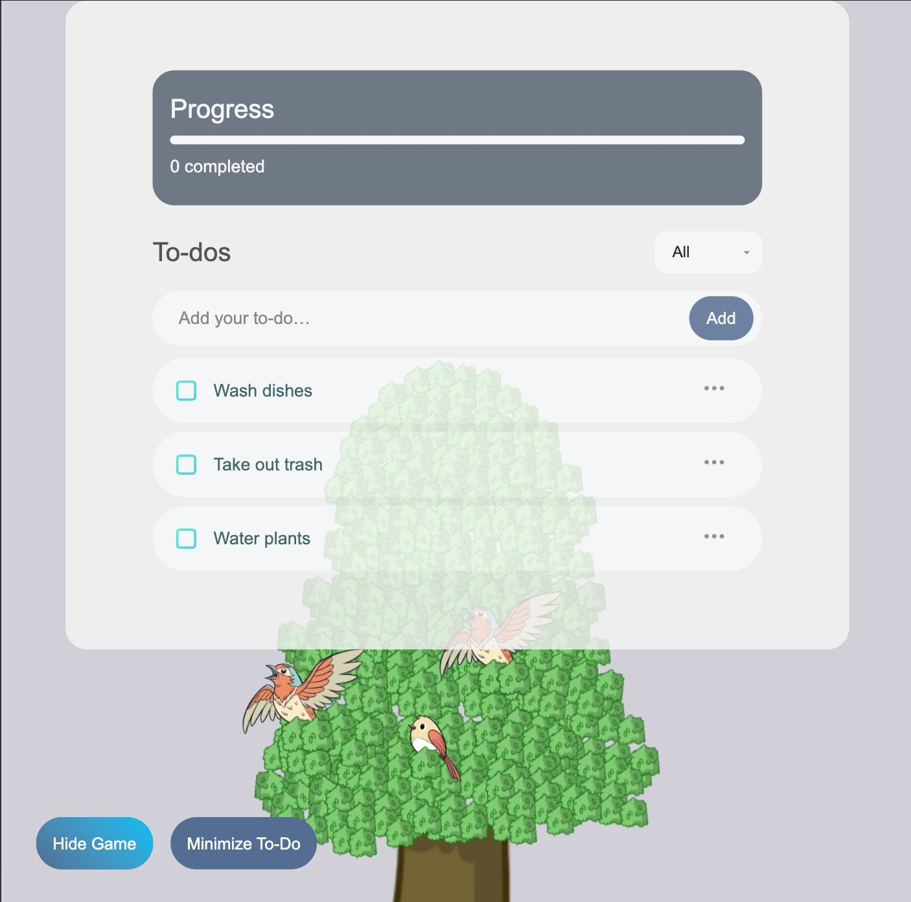
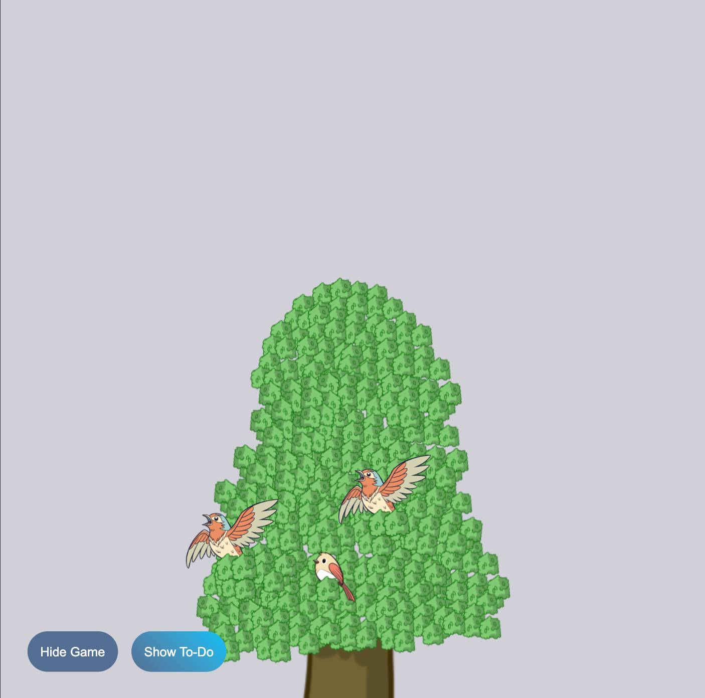

# Gamified To-Do App

**Online/Deployed App Link: [https://shivamjha1998.github.io/todoApp/](https://shivamjha1998.github.io/todoApp/)**

This is a **React + Vite + TypeScript** to-do application with a **gamified** twist:

- Each task is visualized by a **bird** perched on a virtual tree.
- **Completing** a task causes the bird to rest (fade).
- **Neglecting** a task might make the bird fly away.

To activate this **game mode**, click the button labeled **“Show Game.”** You’ll see a tree filled with birds representing each active to-do.

---

## Overview

Unlike a normal to-do list app, this one adds **visual cues and playful mechanics** to encourage task completion:

1.  **Birds on a Tree**: Each new task spawns a bird at a random position.
2.  **Completion Encouragement**: Checking a task off rests that bird.
3.  **Potential Failure**: If you fail to complete the task, the bird flies away.

This approach aims to **motivate** users through lively feedback and interactive visuals.

---

## Features

1.  **Add / Create To-Do**
    - Enter a title to immediately spawn a new task – and a new bird.
2.  **Toggle Completion**
    - Mark tasks done and see the bird rest.
3.  **Delete To-Do**
    - Remove tasks and free up space on the tree.
4.  **Progress Bar**
    - Quickly see how many tasks are completed vs. total tasks.
5.  **Filters**
    - Switch among **All**, **Done**, or **Undone** tasks.
6.  **Notifications**
    - Brief pop-up messages for adding, completing, or deleting tasks.

---

## Future Enhancements

1.  **Garden / Plant Theme**
    - Swap birds for **plants** that wither if tasks go undone.
2.  **Day / Night Cycles & Seasons**
    - Enhance visuals with changing backgrounds and time-of-day effects.
3.  **NFT Integration**
    - Since Nanameue is into NFTs, we can **mint** collectible skins (birds, plants, etc.) as **rewards** for completing tasks. This further motivates users and creates new business opportunities.
4.  **Skins & Customization**
    - Users could unlock special bird species, plant growth stages, or tree shapes by maintaining to-do streaks.

---

## Tech Stack

- **React**
- **Vite** (for fast bundling)
- **TypeScript**
- **CSS** (basic styling and animations)

---

## How to Run Locally

1.  **Clone the Repository**

    ```bash
    git clone [https://github.com/shivamjha1998/todoApp](https://github.com/shivamjha1998/todoApp)
    cd gamified-todo-app
    ```

2.  **Install Dependencies**

    ```bash
    npm install
    # or
    yarn install
    ```

3.  **Start the Development Servers**

    ```bash
    npm run dev
    # or
    yarn dev
    ```

4.  **Open** http://localhost:5173 (or the port shown in your console) in your browser.

## Screenshots

### Todo View



### Todo and Game View



### Only Game Layout



Enjoy your tasks with a playful approach! If you have any questions or suggestions, feel free to open an issue or submit a pull request.

_This project is not a standard to-do app. It is a gamified version designed to make completing tasks more fun and can potentially tie into future NFT-based rewards._
